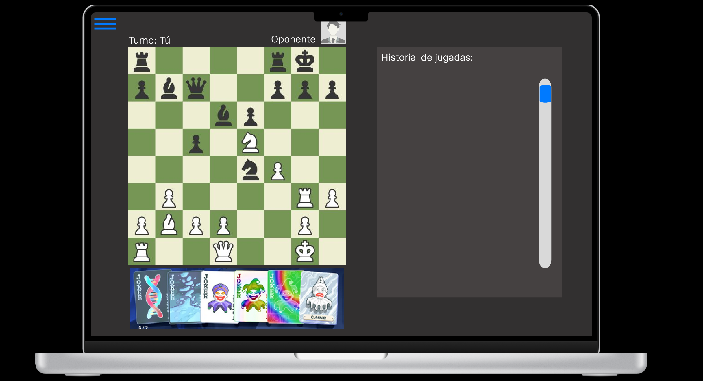
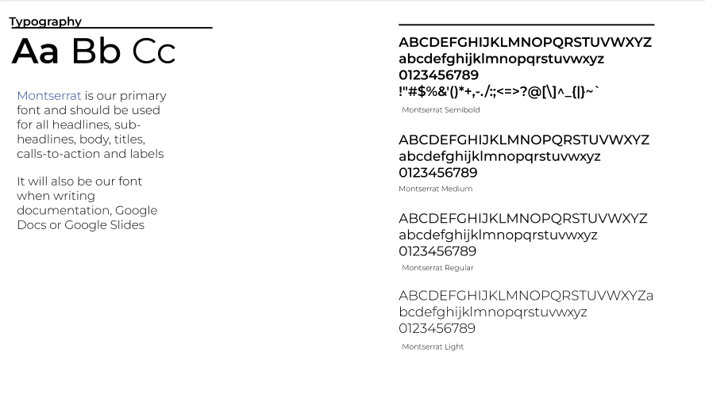

# Los Tralaleros - Frontend 25-1

## 0. Enlance
La aplicación está desplegada en el enlance https://tiny-kelpie-88fe0b.netlify.app/

## 1. Descripción general

### ¿De qué tratará el proyecto?
Para nuestro proyecto crearemos un juego online de ajedrez, pero con un giro interesante, los jugadores tendrán acceso a cartas que les permitirán mejorar sus piezas y realizar movimientos que no son posibles en el ajedrez tradicional. En la partida los jugadores podrán ver su historial de movimientos y las cartas usadas, y los usuarios podrán jugar con sus amigos o personas en línea y ver partidas pasadas.

### ¿Cuál es el fin o la utilidad del proyecto?
El fin del proyecto es crear un juego divertido que atraiga la atención de la gente y permita a los usuarios pasar el tiempo y divertirse con una variante del ajedrez que cambie la fórmula y desafíe a sus jugadores a superar nuevos retos y ser creativos con los nuevos movimientos que podrán ser capaces de realizar con los poderes de las cartas.

### ¿Quiénes son los usuarios objetivos de su aplicación?
Los usuarios objetivos son aquellos aficionados al ajedrez y personas interesadas en el ajedrez, pero que buscan una versión más dinámica o innovadora, todo el mundo puede jugar y cualquiera que tenga un poco de tiempo libre y quiera entretención puede jugar y pasar un buen momento.

## 2. Historias de usuario

### Historias de la aplicación
1. Como jugador, quiero crear una cuenta para guardar mis estadísticas de juego.
2. Como jugador, quiero iniciar sesión para acceder a mi cuenta.
3. Como jugador, quiero unirme a partidas en línea contra otros jugadores para competir con ellos.
4. Como jugador, quiero ver mi historial de partidas y sus resultados para hacer un seguimiento de mi rendimiento.
5. Como jugador, quiero que las piezas puedan usar habilidades para disfrutar de una versión creativa del ajedrez.
6. Como jugador, quiero que las habilidades tengan reglas claras que pueda consultar para planificar mis jugadas estratégicamente.

### Historias de la partida
7. Como jugador, quiero mover mis piezas con clics o toques hacia la posición deseada durante mi turno para realizar jugadas estratégicas.
8. Como jugador, quiero que el sistema valide los movimientos para evitar jugadas ilegales.
9. Como jugador, quiero ver en tiempo real los movimientos de ambos jugadores para mantenerme informado sobre el estado de la partida.
10. Como jugador, quiero usar las habilidades de las piezas cuando desee de forma estratégica para obtener ventaja sobre mi oponente.
11. Como jugador, quiero que se muestre un efecto visual al usar una habilidad para identificar claramente su activación.
12. Como jugador, quiero ver un historial de movimientos durante la partida para analizar el desarrollo del juego.
13. Como jugador, quiero poder reiniciar una partida si ambos jugadores están de acuerdo para facilitar partidas de práctica.
14. Como jugador, quiero poder rendirme y abandonar la partida si ya no deseo continuar.
15. Como jugador, quiero que el sistema determine al ganador al cumplirse las condiciones estándar del ajedrez para finalizar la partida de forma justa.
16. Como jugador, quiero recibir un resumen de la partida al finalizar para tener una visión clara del resultado.

### Historias de interactividad
17. Como jugador, quiero invitar a otro jugador mediante un enlace o código para poder jugar con personas específicas.
18. Como jugador, quiero reportar a otro jugador para evitar comportamientos tóxicos o trampas

### Historias de moderador:
19. Como moderador, quiero recibir los reportes generados por otros jugadores para revisar posibles conductas inapropiadas.
20. Como moderador, quiero poder bloquear cuentas de jugadores reportados para prevenir su participación en nuevas partidas.
21. Como moderador, quiero otorgar permisos de moderador a otros jugadores de confianza para ampliar el equipo de moderación.

## 3. Modelo Entidad-Relación

## 4. Mockup Vistas Importantes

### Landing Page

### About Us

### Match View

## 5. Diseño Web

### Tipografía

### Colores

### Logo

### Ejemplos de aplicación

## 6. Bibliografía
- El Componente PlayableCard fue creado por el usuario *00Kubi* y publicado en UIverse: https://uiverse.io/00Kubi/cowardly-eagle-56 
